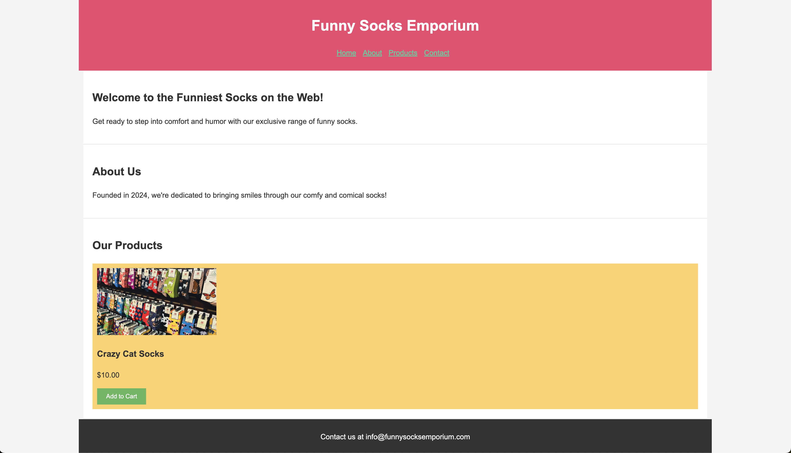

# Funny Socks CSS

Your task is to apply CSS styling to the provided HTML to recreate the appearance of the Funny Socks Emporium website as shown in the accompanying screenshot. Focus on layout, colors, typography, and responsiveness to bring the static HTML to life.

